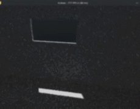

# Path Traced Vulkan Engine

A hardware-accelerated path tracer built from scratch in **Rust** on top of **Vulkan's ray tracing extensions**. This is a personal project focused on realtimeish path tracing.

> **Status: v0.1** -- Works fairly well, but there are performance improvements that still need to happen along with making the denoising even better, probably with some of Nvidia's AI tech

<p align="center">
  
</p>

## What it actually does

- Full hardware ray tracing - BLAS/TLAS built on the GPU, not staged on the CPU
- Raygen / miss / closest-hit / any-hit shader pipeline with a proper SBT
- Physically based material model: albedo, metallic, roughness, emission, transmission, IOR, specular, clearcoat, sheen, and sheen color
- Sky atmosphere model with tunable view/light sample counts
- A `Scene` abstraction that merges multiple models into shared vertex/index/material buffers with material deduplication

## Performance

Running at 1440p on an RTX 5070 in a test scene: **~7.5ms/frame** worst case. The engine is very gpu heavy with little cpu impact.

Some of the wins that got it there:
- Texture LOD bias
- Persistent UBO mapping and cached BLAS geometry to cut CPU side
- Trimming dead work out of the shaders

## What's on the roadmap

- [ ] ReSTIR DI/GI for better sampling efficiency
- [ ] Spatiotemporal denoising (SVGF)
- [ ] Infinite ocean
- [ ] Improving RT core occupancy
- [ ] Implementing some of Nvidia's tech

## Why pure path tracing instead of hybrid?

At an early stage, I had made the hybrid raster then trace setup, however, this led to severe performance regressions due to memory pressure and having multiple pipelines.
Pure RT is very fast with itself since it is already loaded up/there.

## Building

```bash
git clone (https://github.com/DubbsPi/RTX-Vulkan-Engine-Rust.git)
cd RTX-Vulkan-Engine-Rust
# Compile shaders to SPIR-V 1.4
bash shaders/compile.sh
cargo run --release
```

**Requirements:**
- A GPU with hardware ray tracing support
  (*For Compiling*)
- Vulkan SDK
- Rust (stable)

## Tech stack

- **Language:** Rust
- **Vulkan bindings:** [vulkanalia](https://github.com/KyleMayes/vulkanalia)
- **Shaders:** GLSL compiled to SPIR-V

## License

MIT — see [LICENSE](LICENSE).

## Contributing

This is primarily a solo research project, but issues, discussion, and PRs are welcome, especially if you're into RT pipeline architecture, BVH construction, or sampling/denoising techniques.
