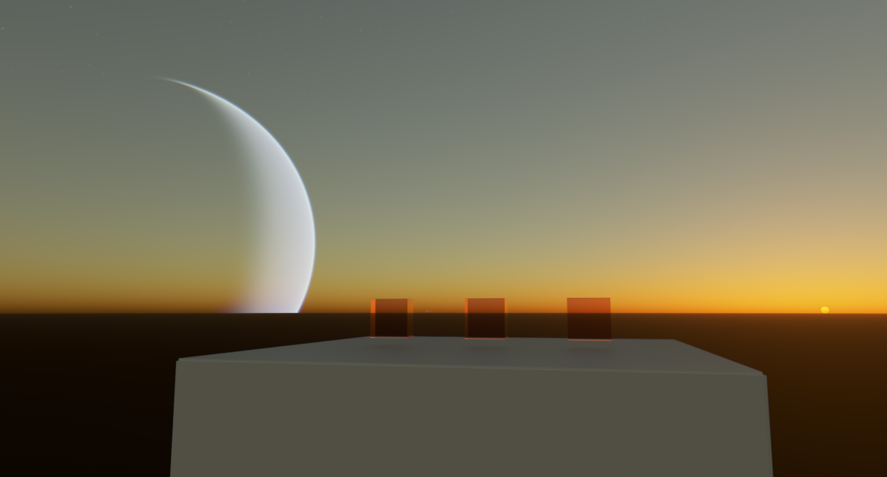
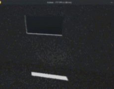

# RTX Vulkan Engine

This is a fully path traced engine I have spent a while working on during school
Currently, it works fairly well, but I definitely have fixes that I need to do for the long term

  

**What I'm planning on Adding:**
- Nvidia's NRD for near perfect denoising
- Better PBR and metals

**Why I made this**

I am planning on using this engine for an actual game in the future
The reasoning behind me making my own engine is that path tracing is generally not common in popular game engines
Even when similar results are then (for example UE5), there are a ton of issues with performance and lacking needed features
This way, I could ensure I had everything I could possibly need while also having the greatest lighting possible

**Features**
- Interplanetary rendering
- Path tracing
- Star system rendering
- Glass
- Next event estimation
- A trous denoising
- GLB model support
- Near full pbr support
- High real-time performance
- Efficient usage of GPU bandwidth

**Really low quality GIF of the tracing in action**

  

